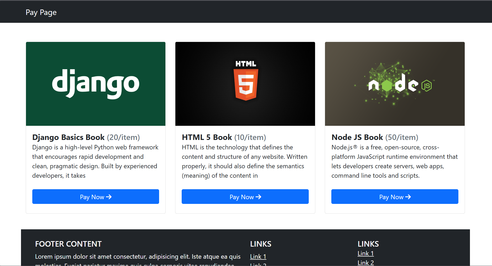
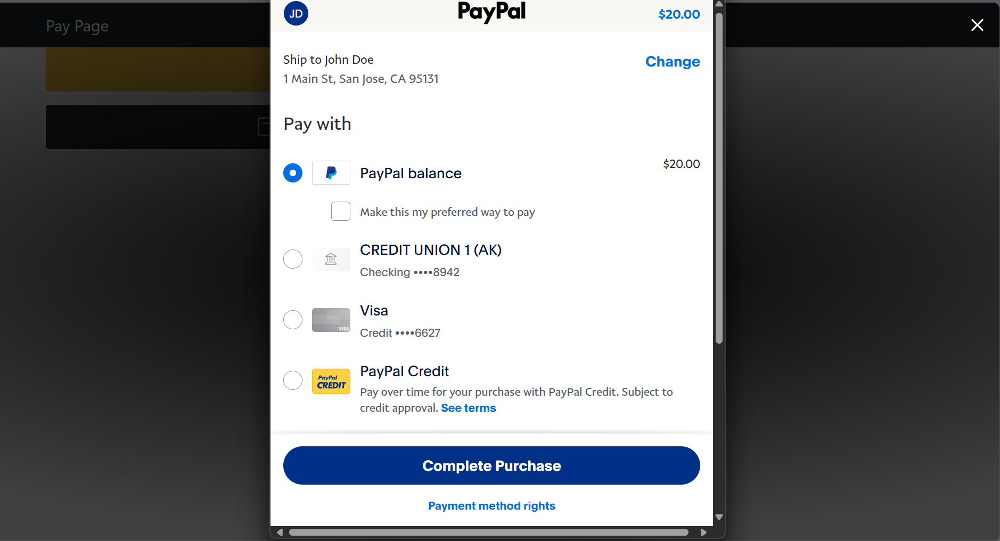
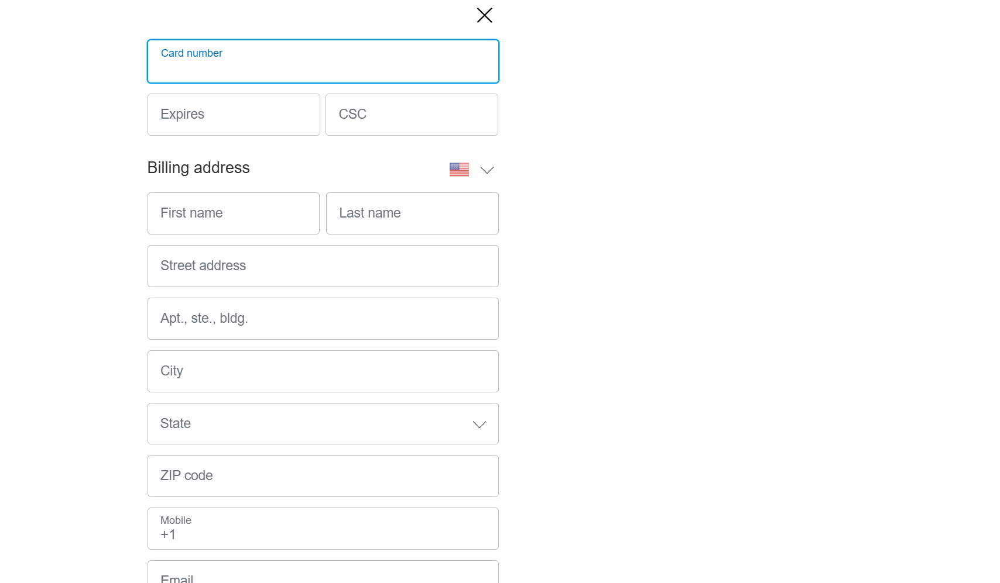

# 📚 Online Book Store with PayPal Integration 💳

A sleek and simple **Book Store Web Application** with integrated **PayPal Payment Gateway**.  
Users can **browse books, add to cart, and checkout securely** using PayPal or Credit/Debit Card.  

---

## ✨ Features
- 📖 **Book Catalog** – Browse and view available books with prices  
- 🛒 **Instant Checkout** – "Pay Now" button for quick and easy purchase  
- 💳 **Multiple Payment Options:**  
  - ✅ PayPal Direct Payment  
  - 💳 PayPal Card Payments (Credit/Debit)  
- 🎨 **Modern & Responsive UI** – Built with Bootstrap for seamless experience  

---

## 🛠️ Tech Stack
- **Frontend:** HTML, CSS, Bootstrap  
- **Backend:** PHP  
- **Payment Gateway:** PayPal SDK Integration  

---

## 📸 Screenshots

### 🏠 Home Page


### 💵 Payment Page


### ✅ Option 1: Pay with PayPal


### 💳 Option 2: Pay with Card (via PayPal)


---

## ⚡ Getting Started

1. **Clone this repository**  
   ```bash
   git clone https://github.com/yourusername/your-repo-name.git
